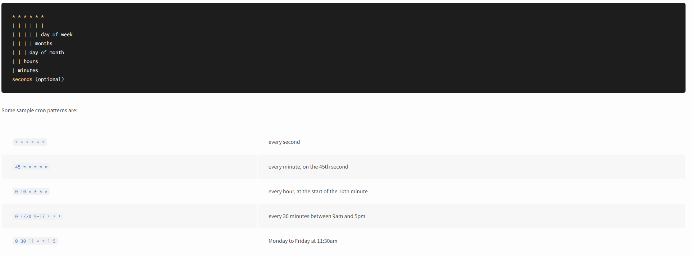

# Stockecc

#Dev environment setup

- create **processed/** dir on your local dev environment
- place an **xlsx** file in the current working directory
- uncomment > // import Config from './config-dev.js';
- uncomment > // const FILE_PATH = './';
